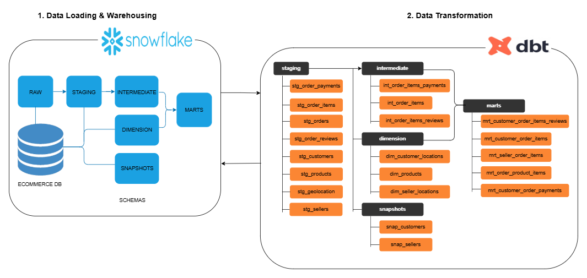

# E-Commerce Analytics

Building a **L**oading and **T**ransformation analytics layer in an Ecommerce Company using [Snowflake](https://www.snowflake.com/) and [dbt](https://www.getdbt.com/product/what-is-dbt).


## 1. Project Overview

This project implements a **production-grade analytics platform** for the Brazilian Olist ecommerce dataset using **Snowflake** and **dbt**. The goal is to transform raw transactional data into **trusted, analytics-ready marts** that answer key business questions around customers, products, sellers, payments, and reviews.

---

## 2. Data Source: Olist Ecommerce Dataset

**Olist** is a Brazilian ecommerce platform that connects small businesses to marketplaces.

[Source](https://www.kaggle.com/datasets/olistbr/brazilian-ecommerce) 

### Raw Data Domains

The dataset contains information about:

* Customers and locations
* Orders and order lifecycle
* Order items and products
* Sellers and seller locations
* Payments and installments
* Customer reviews
* Geolocation (ZIP-code level)

---

## 3. Data Architecture





### Technology Stack

| Layer                | Technology                |
| -------------------- | ------------------------- |
| Cloud Data Warehouse | Snowflake                 |
| Transformation       | dbt                       |
| Modeling             | Kimball-style star schema |
| Data Quality         | dbt tests                 |
| Documentation        | dbt docs                  |

---

## 4. Snowflake RAW Layer

The **RAW schema** contains unmodified data loaded directly from source files. These tables represent the system of record and are never transformed directly.

### RAW Tables

* `customers`
* `geolocation`
* `orders`
* `order_items`
* `order_payments`
* `order_reviews`
* `products`
* `sellers`

**Key Principle**: No business logic is applied in the RAW layer.

---

## 5. dbt Project Structure

```
dbt/ecommerce/
│
├── models/
│   ├── staging/
│   ├── intermediate/
│   ├── dimensions/
│   ├── marts/
│
├── snapshots/
├── tests/
│   ├── singular/
│   ├── generic/
│
├── macros/
├── dbt_project.yml
└── README.md
```

---

## 6. Staging Layer (`stg_` models)

### Purpose

* One-to-one mapping with RAW tables
* Column selection and renaming
* Type casting and basic cleanup
* No joins

### Example Staging Models

* `stg_customers`
* `stg_orders`
* `stg_order_items`
* `stg_order_payments`
* `stg_order_reviews`
* `stg_products`
* `stg_sellers`
* `stg_geolocation`

These models form the **foundation** of all downstream transformations.

---

## 7. Intermediate Layer (`int_` models)

### Purpose

* Apply business logic
* Perform joins across domains
* Resolve many-to-many relationships
* Prepare data for dimensional modeling

### Key Intermediate Models

| Model                      | Description                    |
| -------------------------- | ------------------------------ |
| `int_order_items`          | Orders joined with order items |
| `int_order_items_payments` | Orders + items + payments      |
| `int_order_items_reviews`  | Orders + items + reviews       |

This layer prevents logic duplication in marts.

---

## 8. Dimension Models (`dim_` models)

### Purpose

* Describe business entities
* Support slicing and filtering in BI tools
* Used as lookup tables in marts

### Dimensions

| Dimension                | Description                         |
| ------------------------ | ----------------------------------- |
| `dim_customer_locations` | Customers enriched with geolocation |
| `dim_products`           | Product attributes                  |
| `dim_seller_locations`   | Sellers enriched with geolocation   |

Dimensions are incremental and snapshot-ready.

---

## 9. Mart Layer (`mrt_` models)

### Purpose

* Analytics- and BI-ready fact tables
* Clear grain definitions
* Optimized for querying and dashboards

### Fact Marts

| Mart                               | Grain                               | Business Use Case     |
| ---------------------------------- | ----------------------------------- | --------------------- |
| `mrt_customer_order_items`         | Customer × Order × Product          | Purchase behavior     |
| `mrt_customer_order_items_reviews` | Customer × Order × Product × Review | Customer satisfaction |
| `mrt_customer_order_payments`      | Order × Payment                     | Payment behavior      |
| `mrt_order_product_items`          | Order × Product                     | Product performance   |
| `mrt_seller_order_items`           | Seller × Order × Product            | Seller performance    |

---

## 10. Business Questions Answered

This analytics stack enables answers to critical ecommerce questions:

### Customer Analytics

* Who are the most valuable customers?
* How does customer location impact delivery time?
* How do customer reviews correlate with repeat purchases?

### Product Analytics

* Which product categories generate the most revenue?
* What products receive the highest and lowest reviews?
* How do shipping costs vary by product size and weight?

### Seller Analytics

* Which sellers generate the highest revenue?
* Which sellers have the fastest delivery times?
* How does seller location affect fulfillment performance?

### Payments Analytics

* What payment methods are most commonly used?
* How often do customers pay in installments?
* What is the average order value by payment type?

### Reviews & Experience

* How do delivery delays impact review scores?
* Which products or sellers receive poor reviews?
* What factors drive 5-star reviews?

---

## 11. Data Quality & Testing

All tests are defined in the **`/tests` folder**.

### Test Types

* **Singular tests** (business rules, joins, anomalies)


### Examples

* No negative prices or freight values
* Valid order statuses
* Enforced primary and foreign keys

Tests fail if any invalid rows are returned.

---

## 12. Snapshots (Slowly Changing Dimensions)

Snapshots track historical changes to dimension attributes.

### Implemented Snapshots

* `snap_customer`
* `snap_seller`

Tracked attributes include:

* City
* State
* ZIP code

Enables historical analysis such as *"Where was the customer located at the time of purchase?"*

---

## 13. Macros

Reusable SQL logic is centralized in macros.

### Example Macros

* `generate_schema_name`

Improves consistency and reduces duplication.

---

## 14. Documentation & Lineage

* All models and columns are documented
* Full lineage available via `dbt docs`
* Exposures connect marts to BI dashboards

### Generate Docs

```bash
dbt docs generate
dbt docs serve
```

---

## 15. Incremental & Performance Strategy

* Incremental models with `merge` strategy
* Defined `unique_key` per model
* Optimized for large-scale ecommerce datasets

Designed to scale with growing order volumes.

---

## 16. Future Enhancements

* Metrics layer (AOV, CLV, retention)
* Cohort analysis models
* Seller SLA scoring
* Customer lifetime value modeling
* Feature store for ML use cases

---

## 🤝 Contributing

Contributions are welcome!

1. Create a feature branch

   ```bash
   git checkout -b feature/xyz
   ```

2. Commit changes

   ```bash
   git commit -m "Add xyz feature"
   ```

3. Push to branch

   ```bash
   git push origin feature/xyz
   ```

4. Open a Pull Request.
